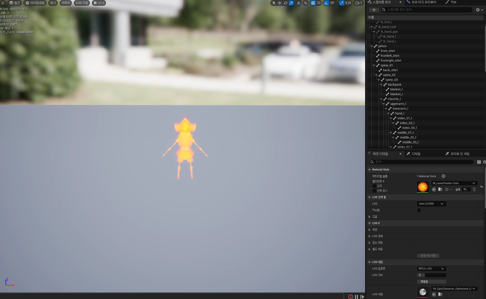
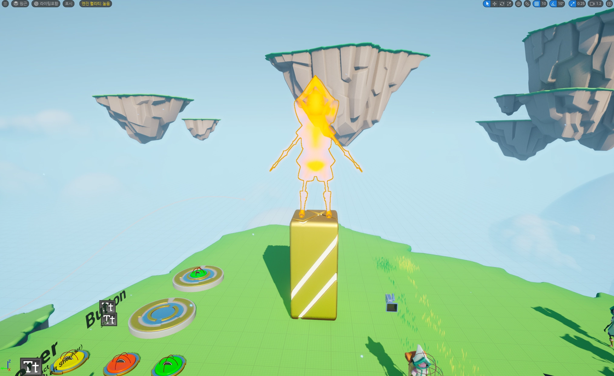
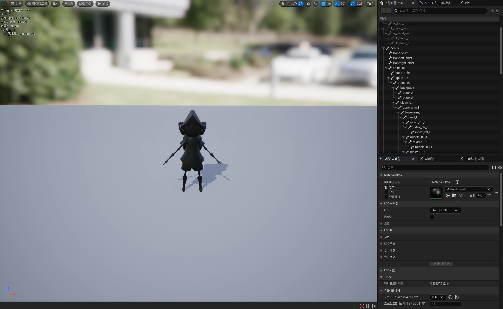
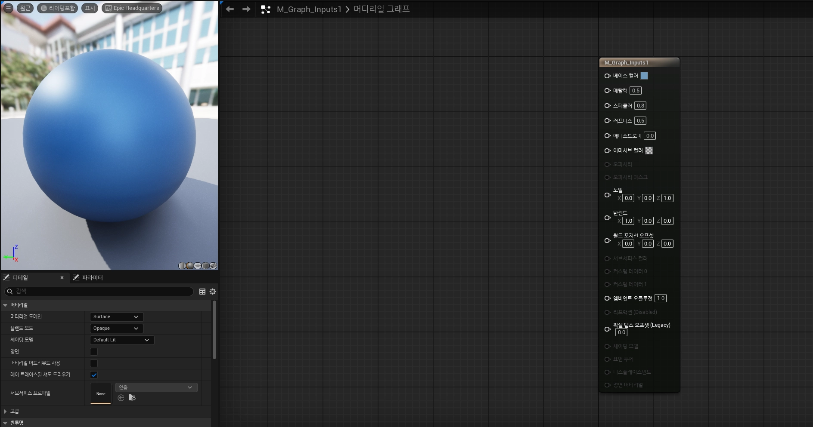
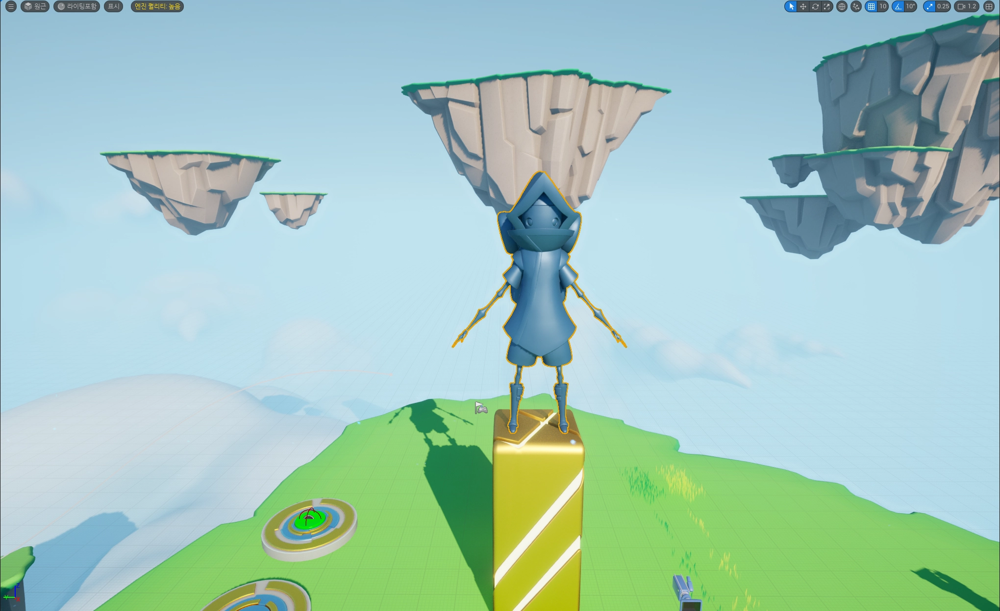

# TIL - 게임 개발 과정과 Unreal Engine 기본 구조

## 학습 내용 요약

오늘은 게임 개발 과정에서 필요한 직군과 Unreal Engine 에디터의 기본 구조, 그리고 월드 구성 요소와 기본 조작 방법을 학습했다.

---

## 핵심 개념 정리

### 게임 개발 직군

* 게임 개발은 여러 직군의 협업으로 이뤄짐

**기획자**

* 스토리와 레벨 구조 설계
* 게임 규칙과 난이도 설정

**아티스트**

* 컨셉 아티스트 → 게임 분위기 설정
* 3D 모델러 → 캐릭터, 환경 등 모델 제작
* 애니메이터 → 캐릭터 움직임 구현

**프로그래머**

* 클라이언트 → 플레이어 조작, UI, 그래픽 연동 구현
* 서버 → 데이터 관리, 보안, 안정성 유지

**사운드 디자이너**

* 배경음악 및 효과음 제작

**PD**

* 일정, 예산, 프로젝트 방향 관리

---

### 언리얼 에디터 구성

**Viewport**

* 3D 월드를 직접 확인하는 공간

**Outliner**

* 배치된 오브젝트 목록 관리

**Details**

* 오브젝트 위치, 회전, 크기 수정

**Content Browser**

* 프로젝트 에셋 관리
* Ctrl + Space로 열기 가능

**Menu Bar**

* 저장, 설정, 빌드 기능 제공

---

### Viewport 내 용어 정리

**World**

* 레벨 존재하는 최상위 컨테이너
* 모든 액터와 구성 요소 포함
* 로직의 상태 관리

**Level**

* 게임 또는 프로젝트의 하나의 씬
* 확장자 .umap
* Type==World 검색 → 프로젝트 레벨 파일 확인

**Actor**

* 월드 내 존재하는 모든 오브젝트
* 로직 담당 및 환경 구성 요소 나타냄

**Pawn**

* 플레이어나 AI가 조종 가능한 오브젝트
* 플레이어 컨트롤러 → 움직임 제어
* AI 컨트롤러 → NPC

---

### Viewport 조작

* 우클릭 + WASD → 이동
* 마우스 휠 → 확대/축소
* 좌클릭 → 오브젝트 선택
* 기즈모로 위치 이동 가능

---

### Transform

* Position(위치) → W
* Rotation(회전) → E
* Scale(크기) → R

---

### 좌표계

* 기즈모 왼손 좌표계 사용
* Local 좌표계 / World 좌표계 존재

---

## 실습

* Blueprint PlayerCharacter를 맵에 배치했다.
* Play 버튼으로 실제 게임 실행을 확인했다.
* WASD 이동과 점프 동작을 테스트했다.
* 머티리얼을 복사하고 값을 변경하여 외형 변화를 확인했다.
* 실습 사진

> M_LaserPointer-Core 머티리얼 사용
 

> 적용모습
> 아래 오브젝트 기즈모 이용해 크기 변경

> M_Graph_inputs 1 머티리얼 사용

> 베이스 컬러 → 블루
> 메탈릭 → 0.5
> 스페클러 → 0.8

> 적용모습

---

## 새로 알게 된 점

* 언리얼 에디터의 구성을 알게 됐다.
* 게임 개발에 어떤 직군이 있는지 알게 됐다.
* 여러 조작 단축키를 알게 됐다.
* 머티리얼 변경 방법을 알게 됐다.

---
