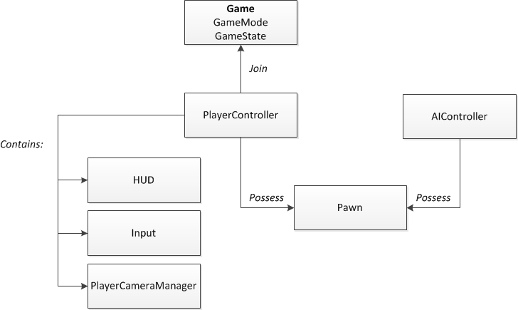

# Unreal 게임개발종합반 1-4 ~ 1-7

---

## 게임 엔진이란?

- 게임 개발에 필요한 그래픽, 물리, 사운드, 네트워크 등을 통합 제공하는 종합 개발 도구

### 주요 기능
- 그래픽 렌더링 → 사실적인 라이팅과 쉐이더 표현
- 물리 엔진 → 점프, 충돌, 중력 처리
- 오디오 엔진 → 배경음과 효과음 제어
- 네트워킹 → 멀티플레이 서버 통신 지원
- AI → NPC 행동 및 의사결정 구현

## Unreal Engine 활용 사례

- 영화 / 시네마틱 → 실시간 렌더링으로 고품질 CG 제작  
- 건축 / 인테리어 → 설계 시각화  
- 자동차 / 제품 디자인 → 재질과 반사 표현 활용  

---

# 퀘스트

## Unreal Engine 주요 기능

- 그래픽 렌더링
- 물리 연산
- 사운드
- 네트워크
- AI

## 주요 키워드

- 엔진 → 게임 개발 종합 도구
- 자체 엔진 → 회사에서 직접 만든 엔진
- 언리얼 엔진 → Epic Games의 고품질 3D 제작 엔진

---

# Unreal 프레임워크 구조

## 핵심 구성

- GameMode → 게임 규칙 정의
- PlayerController → 입력 처리
- Pawn / Character → 조종 가능한 객체
- UI → 화면 인터페이스

- Possess → 컨트롤러가 Pawn을 소유
- HUD → UI 표시

---

# 레벨(Level)

- 게임이 진행되는 맵 / 장면
- Persistent Level + Sub-Level 구조 사용 가능
- 지형 / 조명 / 인테리어 등을 기능별로 분리 가능

---

# 컨트롤러

## PlayerController
- 입력 처리
- 카메라 및 UI 제어
- 플레이어 1명당 보통 1개 존재

## Controller ↔ Pawn 관계
- 컨트롤러가 Pawn을 소유하여 조종
- 소유 변경 시 다른 캐릭터 제어 가능

## AI Controller
- NPC 행동 로직 담당
- Behavior Tree 등으로 구현

---

# UI 시스템

## UMG
- 언리얼 UI 제작 툴
- 블루프린트 기반 UI 설계 가능

---

# Actor 구조

## Actor
- 월드에 배치되는 모든 오브젝트 부모 클래스
- Spawn → Tick → Destroy 흐름
- 위치 / 회전 / 스케일 정보 보유

## Pawn
- Actor 기반 조종 가능한 객체

## Character
- Pawn 기반 이동 기능 포함

## Component
- Actor에 부착 가능한 기능 단위
- 비주얼 / 사운드 등 기능 확장

---

# 실습 내용

## 레벨 관련

- 액터배색에 레벨 컬러 → 레벨 별 다른 컬러 설정 가능
- Streaming Method Blueprint or Always Loded 변경 가능
- LoadStreamLevel(by name)로 레벨 로드 가능

## 레벨 이동 실습

Event BeginPlay → Delay(3초) → Open Level(by Name) level name:ThirdPersonMaps

→ 3초 뒤 ThirdPersonMaps 이동 성공

---

# 퀘스트

## 학습 내용 요약

### 프로젝트 생성 단계 주요 흐름
- Game → Third Person 선택
- 생성 경로 / 이름 설정 후 생성

### 에디터 핵심 요소 3가지
- Viewport
- Outliner
- Details

### Actor 의미와 역할
- 월드에 배치되는 오브젝트의 부모 클래스

### 실습

1.Unreal Engine 5에서 "Blank" 또는 "Third Person" 템플릿으로 새 프로젝트를 생성

2."Viewport"에서 기본 오브젝트를 배치

---

## Fab 마켓플레이스
- 필요한 에셋 다운로드 가능

---

## Actor 정의
- 월드에 배치되는 모든 오브젝트 부모 클래스

# Actor 종류

## Empty Actor
- 컴포넌트 없는 기본 액터
- 로직 또는 위치/트리거 용도로 사용

## Static Mesh Actor
- 고정 메시(3D 모델) 표시용
- 스태틱 메시 컴포넌트 할당 모델/ 머티리얼 통해 시각적 표현
- ex) 건물 / 나무 / 가구 등

## Light Actor
- 씬 조명 제공 담당
- Directional(태양광) / Point(점광원) / Spot(원뿔) / Rect(직사각형)

## Pawn / Character
- Pawn → 조종 가능한 액터 인터렉션 주체
- Character → Pawn 상속 움직임 기본 포함

## Camera Actor
- 게임 시점 설정
- 컷신 / 시네마틱 연출 장면 사용

## Volume 계열 Actor
- PostProcessVolume, LightmassImportanceVolume 등
- 눈에 보이지 않는 게임환경 / 이벤트 제어
- ex)PostProcessVolume 이용 특정 구역 색감 바꿈

---

# 액터 배치 실습

- 드래그 & 드롭으로 배치
- 액터 Ctrl+C / Ctrl+V 복사 붙여넣기
- 액터 Alt+Drag 복제 이동
- W / E / R → 이동 / 회전 / 스케일
- Shift+Drag 활용 정밀 배치
- Snap 기능 그리드 단위 정렬

---
# 퀘스트
## 게임 분석 템플릿

### 게임 이름
발로란트

### 장르
FPS

### 시스템
총기 반동 시스템

### 동작 흐름

1. 발사 입력 발생
2. 첫 탄 정확도 적용
3. 연사 시작
4. 반동 발생
5. 반동 패턴 누적
6. 플레이어 반동 제어
7. 발사 중단 시 안정화

---

## 핵심 요소

- 무기별 반동 패턴
- 플레이어 입력 보정

→ 이 상호작용이 숙련도와 전략성을 결정한다고 판단
